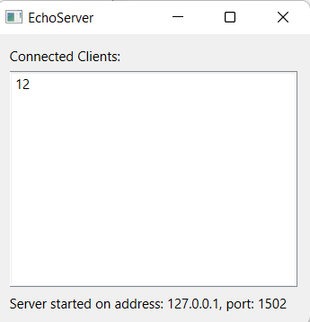
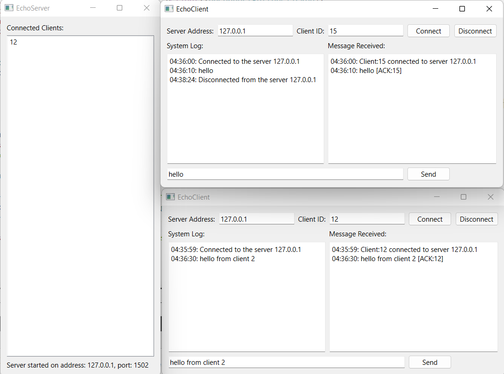

# TCP-Client-Server 🌐

A demonstration of TCP communication where clients communicate with a server and receive acknowledgments. 

## 📡 Communication Protocol

### Protocol Definition:

1. **Connection Request**:
   - Frame: `C:<client_id>:`
2. **Message Sending**:
   - Frame: `M:<client_id>:<message_content>`
3. **Message Acknowledgment**:
   - Frame: `<message_content> [ACK:<client_id>]`
4. **Disconnection**:
   - Frame: `D:<client_id>:`

### 🌟 Frame Example:

- Connection: `C:1234:`
- Message: `M:1234:Hello, Server!`
- Acknowledgment: `Hello, Server! [ACK:1234]`
- Disconnection: `D:1234:`

## 🖥️ TCP Server:

- **Address**: `127.0.0.1`
- **Port**: `1502`

- **Information Label**: 
- `Server started on address`: 127.0.0.1, port: 1502
- **Connected Clients Box**:
- `list of all connected clients by their unique IDs`.

- `Handles multiple client connections simultaneously`.
- 

## 📟 TCP Client GUI:

- **Text Edits**: 
  - `Server Address`, `Client ID`, `Text to Send`.
- **Buttons**: 
  - `Connect`, `Disconnect`, `Send`.
- **Browsers**: 
  - `System Logs`, `Received Messages`.
  - 

## To Start

- Start the server application.
- Start multiple client applications.

### Test Results
- server is not running
- 
- server shutdown
- 
- unique client id
- 
- character check
- 
- multiple clients
- 
- 
- invalid address
- 
- invalid client id (non integer/null)
- 
- 

